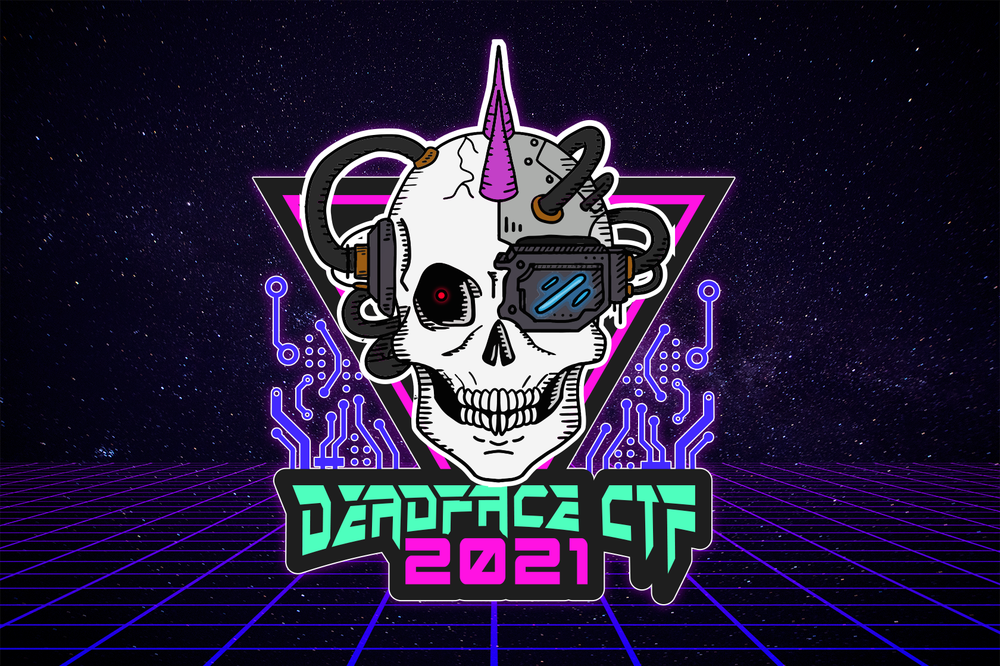

---
# Obsidian
tags:
- ctf
- 2021-deadface

# Jekyll
layout: ctf_homepage
type: homepage
hero-title: Deadface CTF 2021
hero-text:
ctf-description: Cyber Hacktics and CyberUp will once again be hosting a CTF in support of National Cyber Security Awareness Month! Formerly Hacktober CTF, the title of this year's CTF is DEADFACE CTF. Competitors will play on teams of up to four players to take on DEADFACE, the notorious hacker group featured in last year's event.

# CTF info
ctf: 2021-deadface
title: Deadface CTF 2021
---
