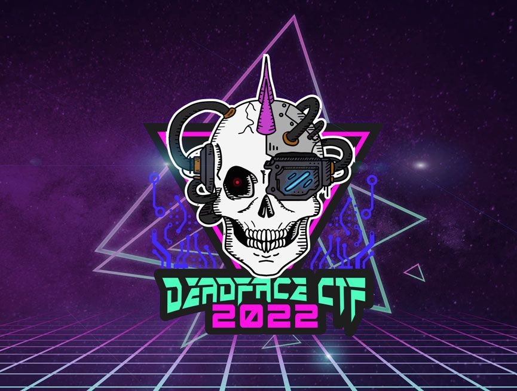

---
# Obsidian
tags:
- ctf
- 2022-deadface

# Jekyll
layout: ctf_homepage
type: homepage
hero-title: Deadface CTF 2022
hero-text: 
ctf-description: Every year, Cyber Hacktics and CyberUp organize a Capture-the-Flag (CTF) event in support of National Cyber Security Awareness Month. Competitors will play on teams of up to four players and must solve challenges relating to various cybersecurity categories.

# CTF info
ctf: 2022-deadface
title: Deadface CTF 2022
---
