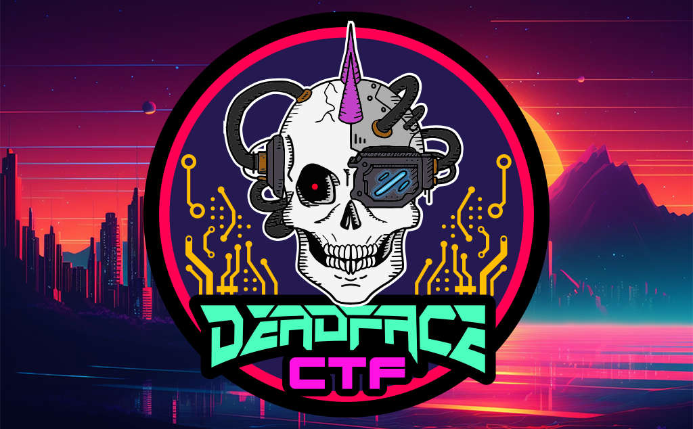

---
# Obsidian
tags:
- ctf
- 2023-deadface

# Jekyll
layout: ctf_homepage
type: homepage
hero-title: Deadface CTF 2023
hero-text: 
ctf-description: Every October, Cyber Hacktics organizes a Capture-the-Flag event in support of Cyber Security Awareness Month. Competitors play on teams of up to four players and must solve challenges relating to various cybersecurity and computer science disciplines.

# CTF info
ctf: 2023-deadface
title: Deadface CTF 2023
---
